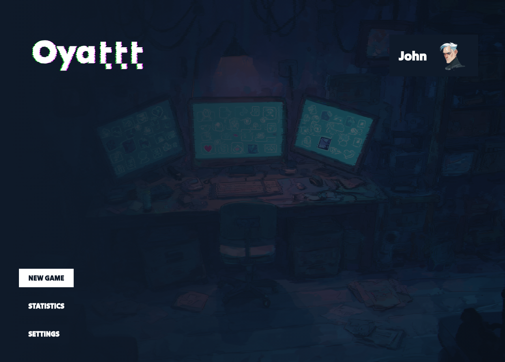
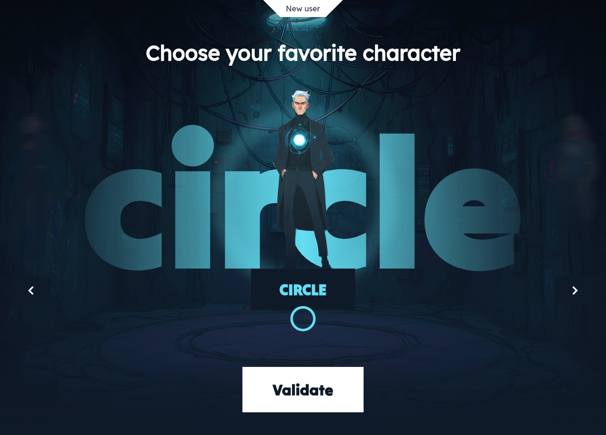
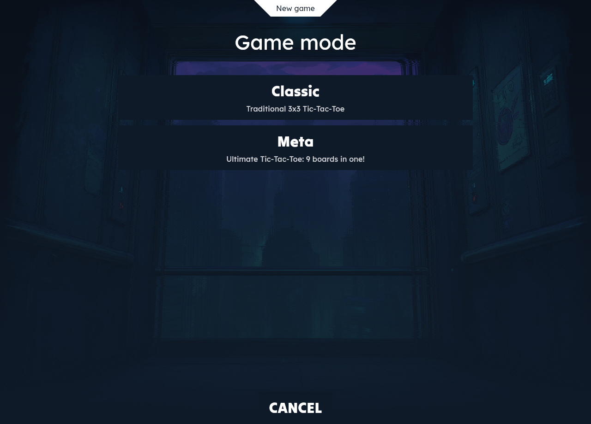
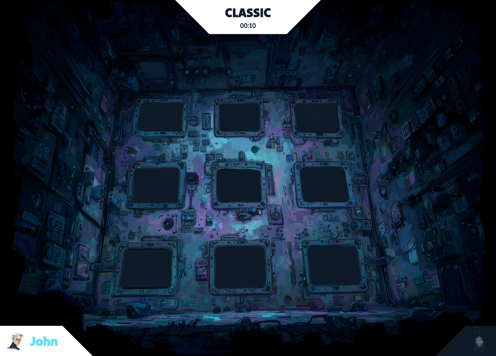
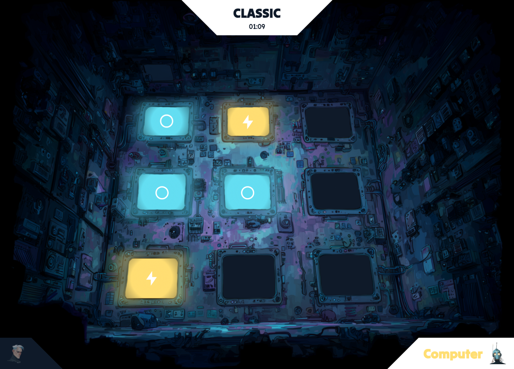
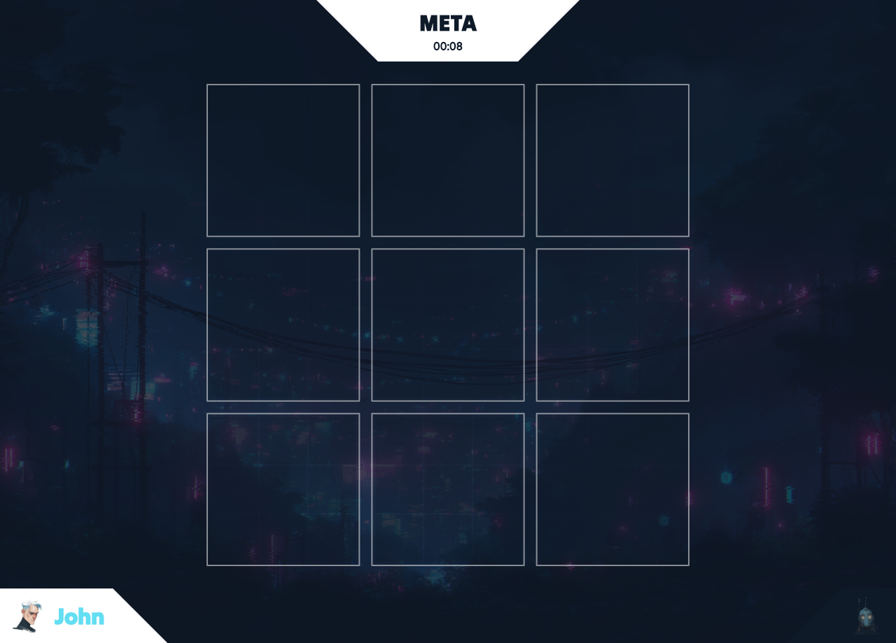
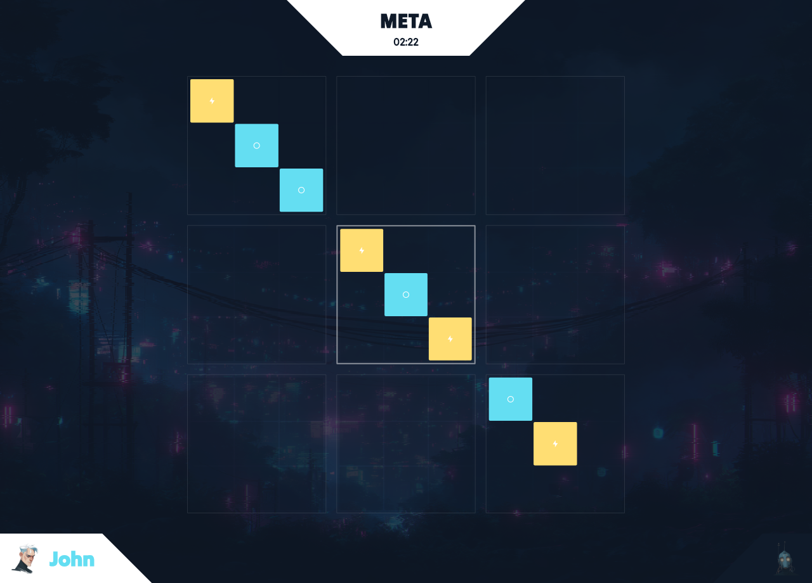
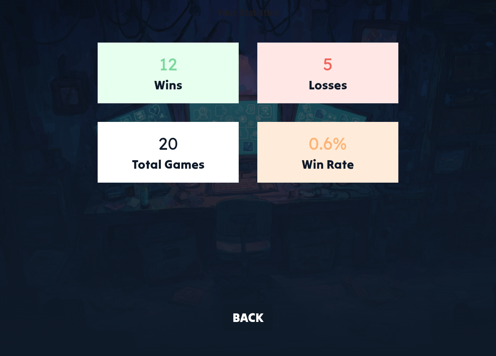
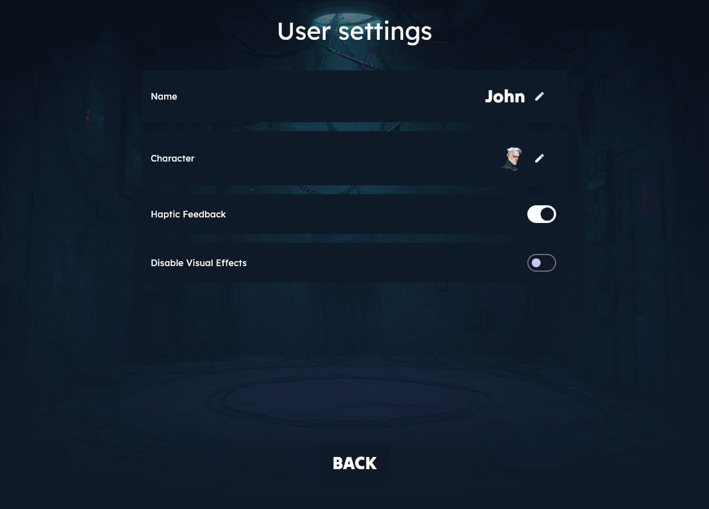

# Oya Tic Tac Toe

Oya Tic Tac Toe is a modern, cross-platform Flutter application that reimagines the classic game with both traditional 3x3 gameplay and Meta Tic Tac Toe (Ultimate Tic Tac Toe)—a recursive variant featuring a 3x3 grid of smaller boards where your move determines your opponent's next board. Built with a clean architecture separating pure Dart game logic (oya_ttt_core) from the Flutter UI (oya_ttt), the game includes AI opponents with multiple difficulty levels, local multiplayer, customizable user profiles with character avatars, internationalization support (English/French), game history tracking, and a beautiful themed interface with custom backgrounds and animations, all deployable to iOS, Android, Web, Windows, macOS, and Linux.

## Screenshots


### Home & Setup




### Classic Mode




### Meta Mode (Ultimate Tic Tac Toe)




### Features




## Features

- **Two Game Modes:** Classic 3x3 Tic Tac Toe and Meta Tic Tac Toe (Ultimate Tic Tac Toe)
- **AI Opponents:** Built-in AI with multiple difficulty levels
- **Local Multiplayer:** Play against friends on the same device
- **User Profiles:** Create and customize player profiles with avatars
- **Internationalization:** Support for multiple languages (English, French)
- **Cross-Platform:** Runs on iOS, Android, Web, Windows, macOS, and Linux
- **Beautiful UI:** Custom themes, backgrounds, and character designs
- **Game History:** Track and review past games

## Project Structure

This is a monorepo with two main packages:

- **`packages/oya_ttt_core/`** - Pure Dart game logic and AI implementation
- **`packages/oya_ttt/`** - Flutter application with UI and platform-specific code

## Getting Started

### Prerequisites

- Flutter SDK 3.9.2 or higher
- Dart SDK 3.9.2 or higher

### Installation

1. Clone the repository:
```bash
git clone https://github.com/yourusername/oya_tic_tac_toe.git
cd oya_tic_tac_toe
```

2. Install dependencies:
```bash
cd packages/oya_ttt
flutter pub get
```

3. Run the app:
```bash
flutter run
```

## License

See [LICENSE](LICENSE) file for details.

## Contributing

Contributions are welcome! Please feel free to submit a Pull Request.
